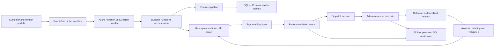

# Azure-Native Vendor Scorecard and Dispatch Design

## Goal

Recommend an eligible vendor for each job while keeping the decision
explainable, auditable, reversible, and safe when AI is unavailable.

## High-level flow

## Canonical data

- `JobEvent`: job ID, type, skills, region, SLA hours, risk, event ID, time.
- `VendorProfile`: vendor ID, regions, skills, capacity, performance, rework,
  response time, supported risk levels, active state.
- `ScoreFactors`: normalized availability, capacity, skills, region,
  performance, rework, SLA, and risk factors.
- `Recommendation`: rank, score, confidence, abstention, factors, rationale,
  model version, job ID.

The repository implements these contracts in `app/models.py`.

## Scoring strategy

1. Reject inactive vendors and vendors with no capacity. The model is never
   consulted about a vendor that fails this gate.
2. Calculate normalized deterministic factors.
3. Apply the visible weights in `app/scoring.py`.
4. Optionally blend a bounded model correction (`model_weight`, clamped).
5. Sort by score, then confidence, then vendor ID for a stable tie-break.
6. Return top 3 by default; the API permits 1–5.

## Authority: score and confidence answer different questions

The score answers "how good is this vendor for this job". Confidence answers
"how much should we trust that answer". They take deliberately different
inputs, and confidence never reads the score.

- **Requirement fit** is the *weakest* satisfied hard requirement (skills,
  region, risk tier, SLA). A vendor perfect on three and absent on the fourth
  is not 75% suitable, it is unsuitable. Fit gates confidence
  multiplicatively, so zero fit yields zero confidence.
- **Evidence strength** measures how well supported the vendor's performance
  rates are: sample size, saturating, decayed by staleness. It ignores how
  *good* the rates are. Unknown provenance scores as weak, so an unverified
  profile biases toward review rather than away from it.

Three independent conditions route a job to a human, each reported as a
specific string in `review_reasons`:

| Trigger | Rationale |
| --- | --- |
| High-risk job | Safety exposure is not bounded by job value, and the model has no representation of it. Policy, not score. |
| Confidence below threshold | Thin or stale evidence, or a partially unmet hard requirement. |
| Margin below threshold | Rank 1 does not clearly beat rank 2, so the ranking is a tie broken on noise. |

`status` is derived from `review_reasons` rather than from the score, so adding
a new policy cannot be forgotten in the status calculation. An empty list is the
only condition under which the system reports itself ready to auto-dispatch.

The deployed implementation is `rules-v1`. The model seam exists, is tested, and
is enabled by configuration rather than by a code change; why it is off in the
deployed stack is explained in [`platform-decisions.md`](platform-decisions.md).
A production model should be promoted only after offline validation on a
time-based holdout, then shadow evaluation against the rules baseline, then a
canary with rollback on business metrics.

## Explainability and human control

Each recommendation returns every factor and a short rationale generated from
the strongest positive factors. Dispatch treats it as advisory until policy
allows automation. High-risk, low-confidence, SLA-critical, or policy
exception jobs require human approval. The override endpoint records actor,
reason, selected vendor, and time.

## Event workflow

- `JobCreated`: dispatch sends job and available profile snapshot.
- Scoring executes once with a request ID.
- `VendorRecommendationGenerated`: output is published for Admin/Dispatch.
- `VendorRecommendationOverridden`: human choice is published for feedback.
- Outcome events should later include acceptance, completion, SLA, rework, and
  cancellation results.

The local `InMemoryEventBus` demonstrates this flow. Azure Service Bus provides
durable delivery, retries, dead-lettering, and consumer isolation.

## Lifecycle and learning

- Version every rules configuration and ML artifact.
- Store input snapshot, output, factors, outcome, and override.
- Detect feature distribution drift, score drift, calibration drift, and SLA
  degradation by region, job type, and risk.
- Review override labels for policy reasons and data leakage.
- Train in Azure ML; validate against a time-based holdout and safety slices.
- Deploy in shadow mode, compare to rules, then canary with rollback.

## Security and PII

- Use managed identity between Azure services.
- Give Admin, Dispatch, ML, and audit roles least-privilege access.
- Keep customer PII outside scoring features unless explicitly approved.
- Encrypt data at rest and in transit.
- Redact PII before audit output; apply retention and access policies.
- Record who made every manual override.

## Cost, scale, and failure modes

- Queue events to absorb bursts from roughly 1,000 vendors.
- Cache stable vendor features; recompute availability at dispatch time.
- Keep scoring stateless and horizontally scalable.
- Batch offline features; use serverless compute for low baseline cost.
- If the scorer is slow, use a timeout and manual queue.
- If it is unavailable, use deterministic fallback or manual dispatch.
- If confidence is low, do not auto-assign.
- Retry transient messages; dead-letter poison events; make handlers idempotent.

## Implementation note

This document is the Azure-native conceptual design the assessment asked for in
Part 1. The runnable Part 2 slice is built on the equivalent AWS services and is
documented in [aws-architecture.md](aws-architecture.md).

That substitution is a deliberate decision, not an oversight. The reasoning, the
full service-mapping table, and the specific evidence that the domain layer is
cloud-agnostic — no module that scores, ranks, or explains a recommendation
imports boto3 — are set out in
[platform-decisions.md](platform-decisions.md). A reviewer weighing whether the
Azure requirement was met should read that document rather than this note.
