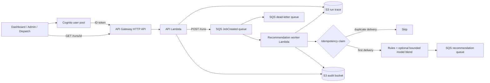

# AWS Vendor Scorecard and Dispatch Design

## End-to-end flow

Only the worker publishes `VendorRecommendationGenerated`. The API Lambda uses
`AuditOnlyEventBus` and holds no send permission on the recommendation queue, so
the synchronous `POST /recommendations` path cannot emit a downstream event by
accident.

## Components

- API Gateway + Lambda: Admin and Dispatch API contract.
- **Cognito JWT authorizer**: every route except `GET /health` requires a valid
  Cognito ID token whose audience matches the app client. `/health` is
  deliberately open so an uptime monitor and the deployment smoke test can run
  without minting a token; it returns only the model version and thresholds.
- SQS: durable input and recommendation queues, both SSE-encrypted.
- Lambda: stateless scoring worker with partial-batch retry handling and an S3
  conditional-write idempotency claim.
- S3: encrypted audit objects, run traces, decision snapshots, and idempotency
  markers under separate key prefixes in one versioned bucket.
- IAM: least-privilege queue and S3 access; the API Lambda cannot write to the
  recommendation queue.
- CloudWatch: structured JSON Lambda logs, queryable directly with Logs
  Insights.
- EventBridge: optional fan-out when many consumers need the same event. Not
  deployed; see [`operations.md`](operations.md) for the cost boundary.
- Managed ML endpoint: deliberately not deployed. See
  [`platform-decisions.md`](platform-decisions.md).

## Canonical contracts

- `JobEvent`: event ID, job, vendor snapshot, and top-k limit.
- `VendorProfile`: skills, regions, capacity, performance, risk, and activity.
- `ScoreFactors`: normalized, human-auditable scoring inputs.
- `Recommendation`: rank, score, confidence, abstention, factors, and rationale.

These contracts are implemented in `app/models.py`.

## Workflow and failure handling

1. Dispatch sends a `JobCreated` JSON message to SQS.
2. Lambda validates the message and calls the existing scoring service.
3. The worker publishes `VendorRecommendationGenerated` to SQS.
4. The worker writes redacted input/output records to S3.
5. Failed records are returned through `batchItemFailures`.
6. SQS retries failures and eventually sends poison messages to the DLQ.
7. Admin can select a vendor manually through the API.
8. The first final decision is classified as AI confirmation or human
   override; repeated selection of the active vendor is idempotent.
9. A different final vendor creates the next decision revision. The active
   decision and revision history are stored under `decisions/{job_id}.json`,
   and each real revision is audited in S3.

SQS delivery is at-least-once, so the worker claims each `event_id` before doing
anything with side effects (`app/idempotency.py`). The claim is an S3
`PutObject` with `IfNoneMatch: "*"`, which S3 evaluates atomically and rejects
with `PreconditionFailed` if the key exists — a compare-and-set primitive
without adding DynamoDB. A redelivered message is logged as
`job_created.duplicate_skipped` and produces no second audit record and no
second `VendorRecommendationGenerated`.

If the runtime's botocore predates conditional writes, the store degrades to a
read-then-write check and reports it through `conditional_writes`. That mode is
racy under simultaneous redelivery of the same message, so it is surfaced rather
than hidden; `src/requirements.txt` pins a botocore new enough to avoid it.

The current S3-only decision store uses bucket versioning to preserve state and
history, but S3 object updates are not an atomic per-job compare-and-set under
concurrent API Lambda invocations. DynamoDB with a conditional version write is
the required next step before claiming strict concurrent single-active-decision
guarantees in production.

## Security

- Lambda execution roles are scoped to required SQS and S3 actions. The API
  Lambda can send to the JobCreated queue only; it has no permission on the
  recommendation queue.
- API Gateway rejects anonymous requests on every route except `GET /health`
  before invoking the API Lambda.
- The override actor is taken from the verified Cognito `sub` claim, never from
  the request body, so an audit record cannot claim another operator's identity.
- S3 public access is blocked, versioning and server-side encryption are on, and
  the bucket policy denies non-TLS requests.
- SQS uses SQS-managed server-side encryption.
- The scorer consumes no customer identity fields. Free text (`title`,
  `details`) influences ranking only through a fixed service-term vocabulary;
  the raw strings never enter `ScoreFactors`.
- Customer identifiers and operator free text are redacted before anything is
  written to the durable audit trail. See [`security.md`](security.md) for the
  exact boundary between the operational store and the audit trail.
- Deployment packages are scoped to `src/` so documents, tests, and local state
  are not shipped to Lambda.
- Use Secrets Manager and KMS for secrets and sensitive configuration.
- Add VPC endpoints/private networking if the deployment requires isolation.

## Lifecycle

- Every recommendation and audit record carries `model_version`, so a decision
  can always be traced to the logic that produced it.
- The model artifact is versioned JSON with its training provenance embedded
  (row count, source, and `training_data_kind`).
- Store recommendation, factors, outcome, SLA result, rework, and override.
- Measure score drift, feature drift, calibration, override rate, SLA, and
  rework by region, job type, and risk. Structured logs make the first pass of
  this a CloudWatch Logs Insights query rather than a metrics pipeline.
- Validate a future hosted model offline and in shadow mode.
- Canary releases must keep the rules fallback available. The worker already
  degrades to rules when an artifact is missing or fails validation.

## Cost and scalability

- SQS and Lambda scale independently from dispatch traffic.
- S3 audit objects are low-cost and immutable.
- Lambda timeout and SQS visibility timeout are configured for bounded work.
- Batch size can be increased after observing latency and failure rates.
- CloudWatch alarms should cover Lambda errors, throttles, age of oldest SQS
  message, DLQ depth, and S3 failures.
